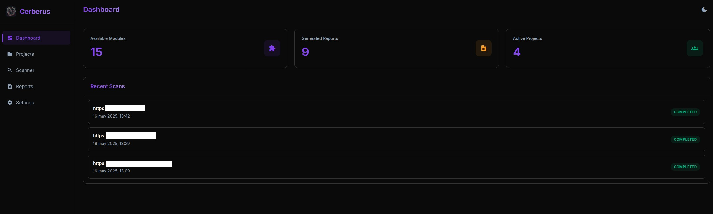

# 🔍 Cerberus - Pentesting Web Application

A web application for automated security reconnaissance, written in Python (Flask) and JavaScript. It integrates advanced scanning tools, automatic report generation, AI assistance, and a dashboard for managing versioned projects and scan results.

## 🚀 Main Features

- Port and service scanning (Nmap)
- DNS reconnaissance (DNSdumpster + MXToolbox + API Ninja WHOIS)
- Email OSINT: leaked emails detection (IntelligenceX + LeakCheck)
- Subdomain enumeration and activity check (Subfinder + HTTPX)
- Web vulnerability scanning (Nuclei)
- CMS detection (WhatWeb)
- Website screenshot capture (Pyppeteer)
- Web directory and file enumeration (Feroxbuster)
- WordPress reconnaissance and brute force (WPScan)
- Joomla reconnaissance (Joomscan)
- FTP service analysis (ftplib + Searchsploit)
- SSH brute-force and analysis (Hydra + Searchsploit)
- Automatic PDF report generation (ReportLab)
- Built-in AI assistant using Gemini Flash 2.0

## 🧠 AI Assistant

Includes a generative AI model that can:
- Suggest next steps after a scan
- Recommend solutions for detected vulnerabilities
- Answer technical questions based on scan results

## 🖥️ Usage Modes

### Graphical User Interface (GUI)

Allows users to:
- Create and manage audit projects
- Launch normal or comprehensive scans
- View versioned reports and track audit history

### Command-Line Mode

```bash
python3 main.py <target> [-p <project>] [-ex]
````

* `-p`: Associate the scan with an existing project
* `-ex`: Enable exhaustive scan mode

## ⚙️ Requirements

* Python 3
* Linux OS (recommended)
* All dependencies are listed in `requirements.txt`

Install dependencies with:

```bash
pip install -r requirements.txt
```

## 📸 Screenshot

<br/>

<p align="center">
  
</p>

## License
This project is distributed under a Creative Commons Attribution-NonCommercial 4.0 International (CC BY-NC 4.0) license.


